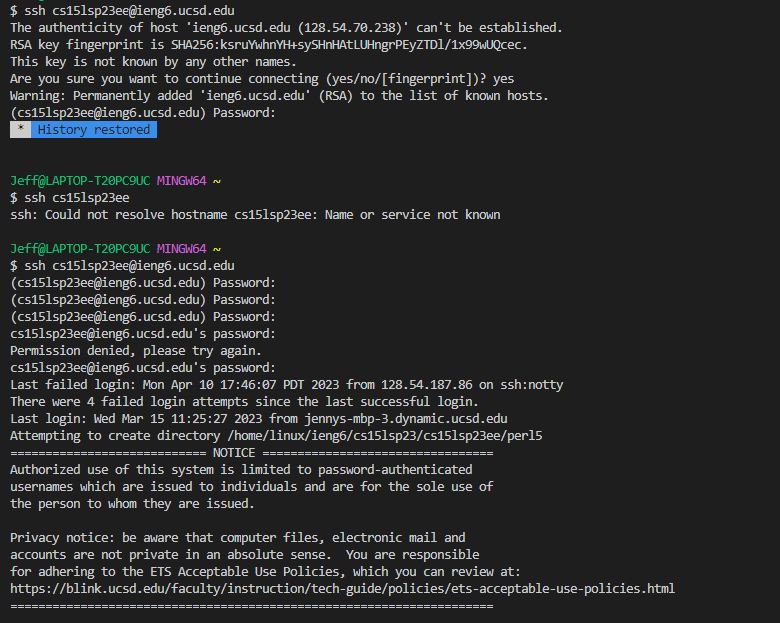

<h1>Lab Report 1</h1>

<h2>Step 1</h2>

To install VSCode is relatively simple, just go to the website at [Visual Studio Code](https://code.visualstudio.com/) and download VSCode from there. Afterwards,
just follow the setup instructions after running the exe file. If everything worked fine, a screen similar to mine should show up once
you run VSCode.

.png)

<h2>Step 2</h2>

Afterwards, to remotely connect to the ucsd server, first download GIT for Windows from (https://gitforwindows.org/). Then to access the bash terminal, follow these 
steps here at (https://stackoverflow.com/questions/42606837/how-do-i-use-bash-on-windows-from-the-visual-studio-code-integrated-terminal/50527994#50527994).
Afterwards, connect to the server by using the command `ssh (yourcse15lusernamehere)@ieng6.ucsd.edu`  , press yes for the authentication question and then
enter your password (WHICH WILL BE INVISIBLE WHEN INPUTTING IT)

<h2>Step 3</h2>

Then, run some commands after you've connected to the terminal. In my instance, I used some simple commands such as `cd ~`, `cd`, and `ls -lat`. cd stands for change
directory which lets you change which directory you want to go to. Typing cd alone just redirects you to the current directory. Typing `cd ~` will change the directory
to the home directory. `ls -lat` lists all the files in the current directory in order of most recently modified which is what the picture in the next page is showing.
Not shown are more complicated commands such as the `cp` command which allows you to copy files from one location to another, and the `cat` command which will
display the contents of a file to the terminal. For instance, cat /home/linux/ieng6/cs15lsp23/public/hello.txt would display the text in the hello.txt file.
 

