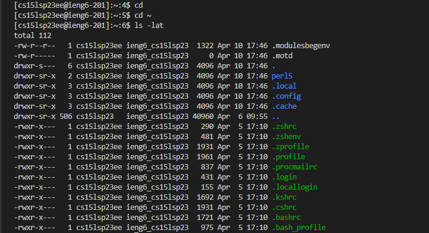

To install VSCode is relatively simple, just go to the website https://code.visualstudio.com/ and download VSCode from there. Afterwards,
just follow the setup instructions after running the exe file. If everything worked fine, a screen similar to mine should show up once
you run VSCode.

.png)

Afterwards, to remotely connect to the ucsd server, first download GIT from https://gitforwindows.org/. Then to access the bash terminal, follow these 
steps here at https://stackoverflow.com/questions/42606837/how-do-i-use-bash-on-windows-from-the-visual-studio-code-integrated-terminal/50527994#50527994.
Afterwards, connect to the server by using the command ssh (yourcse15lusernamehere)@ieng6.ucsd.edu  , press yes for the authentication question and then
enter your password (WHICH WILL BE INVISIBLE WHEN INPUTTING IT)

Then, run some commands after you've connected to the terminal. In my instance, I used some simple commands such as cd ~, cd, and ls -lat.

