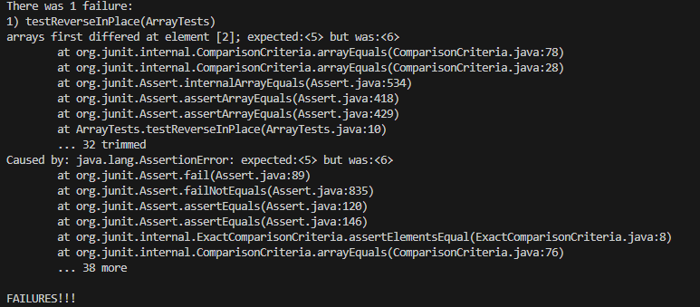
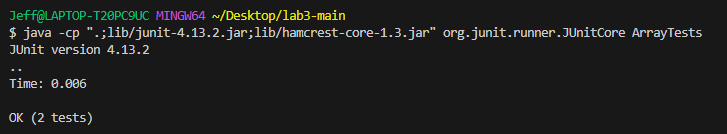

<h2>PART 1</h2>

Here's the code for my StringServer.


When I call upon `</add-message?s=Hello>`, you can see below that the message, Hello appears. Firstly, the code initializes the variable message, which is empty
right now since this is the first time we're adding a message. Then the if statemate checking to see if our request has /add-message in it runs, and since we do have
that, we initialize string query to get the query of our url. Then an if statement runs to make sure the query isn't empty and that the query starts with s=. Since
we have those, we initialize String newMessage with that of the text after s=. Then we concatenate message with newMessage to add upon the existing message passing
the if statement to check if the message was blank. With this code being, run, the website should finally display our message, Hello. 


As for calling upon a second add message, this time with `</add-message?s=How are you>`. The code will run identically to what I described above. However, remember that 
our message from last time will save. So message will initalize with value "Hello". However this time the if statement where it checks if message is blank will be put
into play here now. Since our message is not blank now, our new message will now be consisting of the original message and then a new line with the new message we put.


<h2>PART 2</h2>

For reverseInPlace, this JUnit test makes the code fail. 

```
   @Test
   public void testReverseInPlace() {
      int[] input2 = { 3, 5, 6, 7 };
      int[] test = { 7, 6, 5, 3};
      ArrayExamples.reverseInPlace(input2);
      assertArrayEquals(test, input2);
   }
```
And here is the output you would get when you run the test. 



However, there is a case where it will pass the JUnit test, which is when there is only one element in the array so the malfunctioning code has nothing to mess up the
array with.

```
   @Test 
   public void testReverseInPlace() {
      int[] input1 = { 3 };
      ArrayExamples.reverseInPlace(input1);
      assertArrayEquals(new int[]{ 3 }, input1);
   }
   
```
And the output, which says it passed the test.



Here is the original code that I will fix.

```
  static void reverseInPlace(int[] arr) {
    for(int i = 0; i < arr.length; i += 1) {
      arr[i] = arr[arr.length - i - 1];
    }
  }
```

Here's the code that will fix it.

```
static void reverseInPlace(int[] arr) {
   for (int i = 0; i < arr.length / 2; i++) {
      int temp = arr[i];
      arr[i] = arr[arr.length - i - 1];
      arr[arr.length - i - 1] = temp;
   }
}
 ```
 This would fix the code because the previous code failed to take into account the elements shifting during the for loop, messing with the reverse operation.
 With this new code, creating a temp variable that saves the current element allows you to account for the shift in elements and thus properly reverse the array.
 
 <h2>PART 3</h2>
 
 One thing I learned in week 2 was learning how to start up my own remote server and accessing it through local host. I didn't know at all how to even start up
 a server and I didn't know you could access that server from my very own website. Learning how to do that using VSCode was quite the learning experience.
 
 
