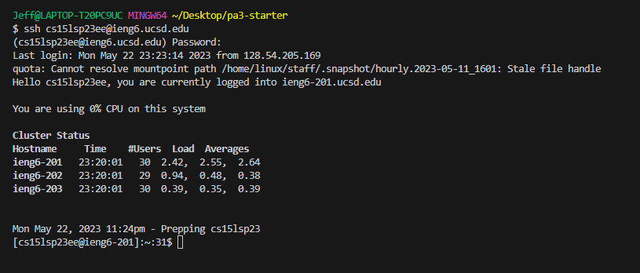
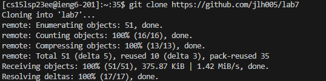
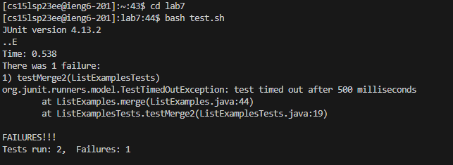
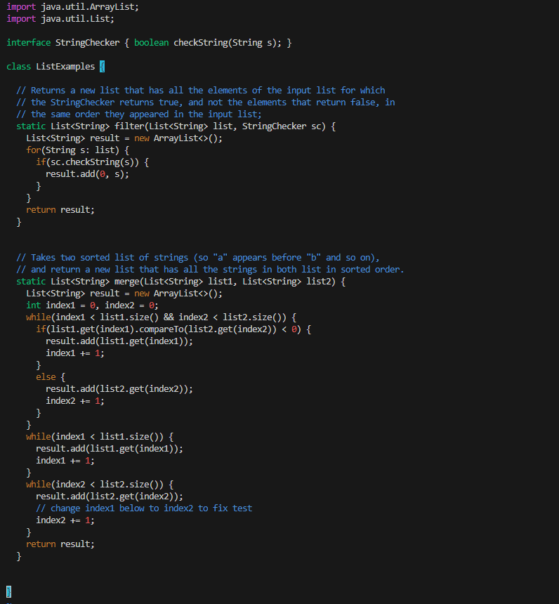
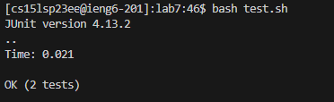
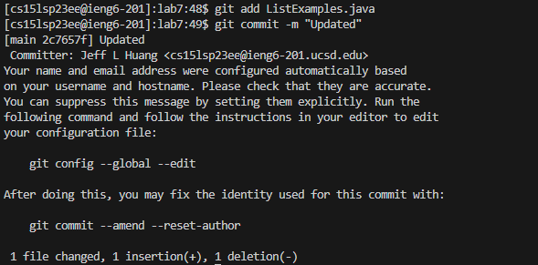

<h1> Lab Report 4 </h1>

<h2> Step 4 </h2>
The first thing to do is to login into my ieng6 account. 

```
ssh cs15lsp23ee@ieng6.ucsd.edu
```



<h2> Step 5 </h2>

The next thing to do is to clone my fork of the repository. Using git clone, I cloned the repository into the directory lab7.
Here's the command I used:

```
git clone https://github.com/jlh005/lab7

```
As you can see from the screenshot below, it was successful in cloning.



<h2> Step 6 </h2>

Next thing to do is to run the tests. First, we must change our directory to lab7, then run the bash script which is responsible for the tests.

Here are the commands I use to do that.

```
cd lab7
```
```
bash test.sh
```

As you can see, one of the tests fail as expected.



<h2> Step 7 </h2>

So let's enter into vim to fix the code so the tests work as expected.
First, enter this command
```
vim ListExamples.java
```

Now we're in vim, I use this command to go straight to the troublemaking line.

```
:44
```
Then, I use the following inputs to fix the code.
```
l, l, l, l, l, r, 2

```
The code is fixed! We replace 1 with 2.

Now we save the code using

```
:wq
```



<h2> Step 8 </h2>

Now let's run the tests again using 
```
bash test.sh
```
Success! it worked!



<h2> Step 9 </h2>

Now let's commit our changes to our fork. 
First we must add our file we modified using
```
git add ListExamples.java
```

Then we commit the changes to our fork with a message

```
git commit -m "Updated"
```

And we're finished!




